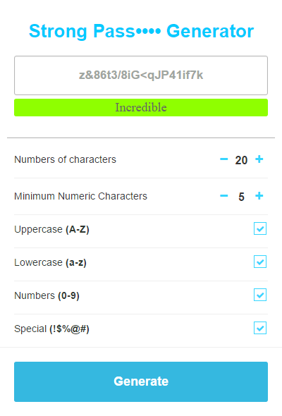

Strong Password Generator
========

Install plugin here: https://goo.gl/vVuXtZ

Simple chrome plugin extension that randomly generates a password based on user options.

  

## Installation

1. [Download the package](https://github.com/ProductOfAmerica/PasswordGenerator/archive/master.zip)
2. Open up the [chrome extensions tabs](chrome://extensions), and then:
3. Click the Load unpacked extensions button
4. Navigate to the directory that holds the downloaded files
5. Select it!
6. It should now be installed, and you can generate random passwords!
