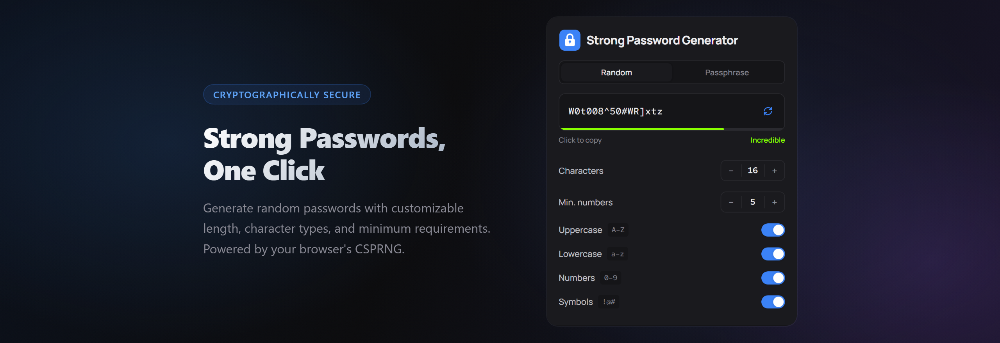

<h1 align="center">Strong Password Generator</h1>

<p align="center">
  <a href="https://github.com/ProductOfAmerica/PasswordGenerator/actions/workflows/ci.yml"></a>
  <a href="LICENSE"></a>
  <a href="https://developer.chrome.com/docs/extensions/develop/migrate/what-is-mv3"></a>
  <a href="https://www.typescriptlang.org/"></a>
  <a href="https://svelte.dev/"></a>
</p>

<p align="center">
  
</p>

<p align="center">
  A Chrome extension that generates cryptographically secure random passwords and memorable passphrases.
  <br>
  Built with WXT, Svelte 5, Tailwind CSS 4, and TypeScript.
</p>

---

## Features

- **Random passwords** — configurable length (1-128), uppercase, lowercase, numbers, symbols, with minimum digit enforcement
- **Passphrases** — word-based generation from a 2,048-word list with customizable word count (1-20) and separators
- **Cryptographically secure** — uses `crypto.getRandomValues()` with rejection sampling to eliminate modulo bias. No `Math.random()`.
- **Strength meter** — real-time color bar (red to green) with 11-tier labels from "Abysmal" to "Phenomenal"
- **Click to copy** — click anywhere in the password field. Clipboard auto-clears after 30 seconds.
- **Dual-tab state** — switch between Random and Passphrase tabs without losing either password
- **Settings sync** — preferences persist across sessions and devices via Chrome sync storage
- **Dark mode** — automatically matches your system theme
- **Fully offline** — all fonts and assets bundled locally. Zero network requests.
- **Accessible** — ARIA labels, keyboard navigation, screen reader support, focus indicators

## Install

**Chrome Web Store:** [Install](https://chromewebstore.google.com/detail/lkahbfdjppdglmacdhifnfaokjealmba)

**Manual:** Load the `.output/chrome-mv3/` directory as an unpacked extension in `chrome://extensions`.

---

## v2.0 — Complete Rewrite

This version is a ground-up rewrite of the original extension.

|                     | v1                                | v2                                                 |
| ------------------- | --------------------------------- | -------------------------------------------------- |
| **Manifest**        | v2                                | v3                                                 |
| **UI**              | Vanilla JS + Bootstrap 3 + jQuery | Svelte 5 + Tailwind CSS 4                          |
| **Language**        | JavaScript                        | TypeScript                                         |
| **Build**           | None                              | WXT + Vite                                         |
| **RNG**             | `Math.random()`                   | `crypto.getRandomValues()` with rejection sampling |
| **Passphrase mode** | —                                 | 2,048-word BIP39-style list                        |
| **Strength meter**  | —                                 | Color bar + 11-tier labels                         |
| **Dark mode**       | —                                 | System preference                                  |
| **Tests**           | —                                 | 51 unit + 8 E2E                                    |
| **Analytics**       | Google Analytics                  | None                                               |
| **Fonts**           | CDN (Google Fonts)                | Bundled locally                                    |
| **Clipboard**       | Manual                            | Auto-clear after 30s                               |
| **Onboarding**      | —                                 | Welcome page on install                            |
| **Privacy policy**  | —                                 | Bundled in extension                               |
| **CI/CD**           | —                                 | GitHub Actions                                     |

---

## Security

All randomness comes from the [Web Crypto API](https://developer.mozilla.org/en-US/docs/Web/API/Crypto/getRandomValues) via `crypto.getRandomValues()`.

- **Rejection sampling** in `getRandomIndex()` eliminates modulo bias, ensuring uniform distribution across any range
- **Fisher-Yates shuffle** randomizes password character ordering using the CSPRNG
- **No password storage** — generated passwords exist only in reactive state, never written to disk, storage, or network
- **Clipboard hygiene** — auto-clears 30 seconds after copy
- **Minimal permissions** — only `storage` for syncing preferences. No `tabs`, `activeTab`, or host permissions.

---

## Development

```bash
pnpm install          # Install dependencies
pnpm dev              # Dev server with hot reload
pnpm build            # Production build -> .output/chrome-mv3/
pnpm test             # Unit tests (Vitest)
pnpm test:e2e         # E2E tests (Playwright, requires build)
pnpm check            # TypeScript type checking
pnpm zip              # Package for Chrome Web Store
```

### Project Structure

```
src/
  entrypoints/
    background.ts              Service worker: settings init + onboarding
    popup/
      App.svelte               Main UI component
      app.css                  Styles + theme variables
      index.html               Popup entry point
      main.ts                  Svelte mount
  utils/
    password.ts                CSPRNG, generation, scoring, color interpolation
    wordlist.ts                2,048-word BIP39-style list
    defaults.ts                Settings interface + defaults
    __tests__/
      password.test.ts         51 unit tests
e2e/
  popup.spec.ts                8 end-to-end tests
public/
  icon/                        Extension icons (16-128px)
  fonts/                       Bundled Manrope + Red Hat Mono
  privacy.html                 Privacy policy
  welcome.html                 Onboarding page
```

### Tech Stack

|                     |                                                    |
| ------------------- | -------------------------------------------------- |
| Extension framework | [WXT](https://wxt.dev) 0.20.20                     |
| UI                  | [Svelte](https://svelte.dev) 5.53.7                |
| Styling             | [Tailwind CSS](https://tailwindcss.com) 4.2.2      |
| Language            | [TypeScript](https://www.typescriptlang.org) 5.9.3 |
| Unit tests          | [Vitest](https://vitest.dev) 4.1.1                 |
| E2E tests           | [Playwright](https://playwright.dev) 1.58.2        |
| CI/CD               | [GitHub Actions](.github/workflows/ci.yml)         |

---

## Privacy

This extension collects no personal data. Generated passwords are never stored or transmitted. All generation happens locally using your browser's built-in cryptographic APIs. See the full [privacy policy](public/privacy.html).

## License

[GPL-3.0](LICENSE)
